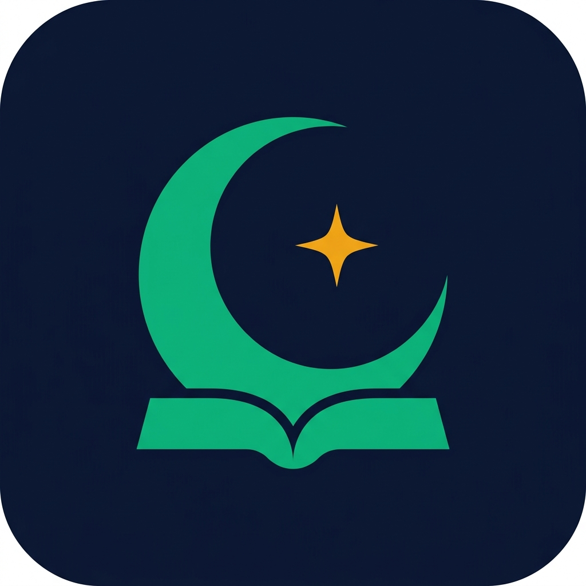
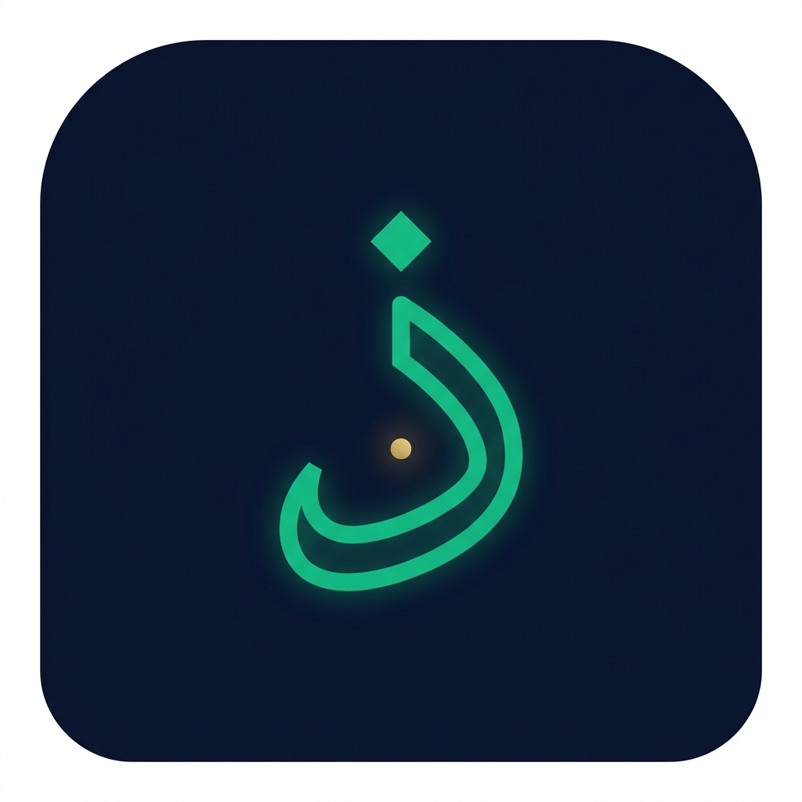
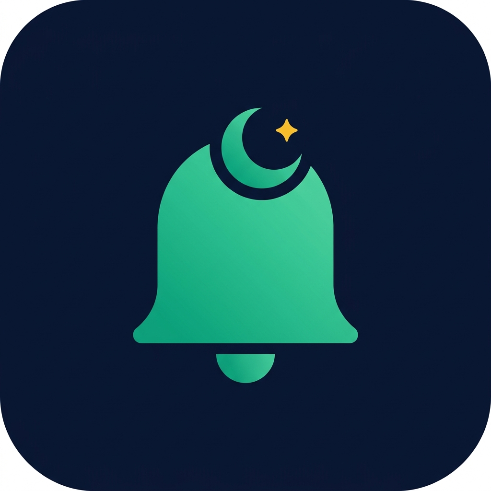
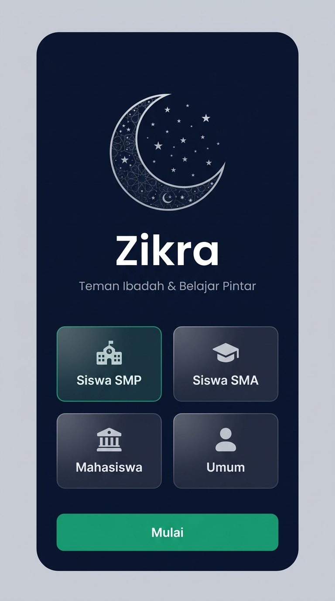
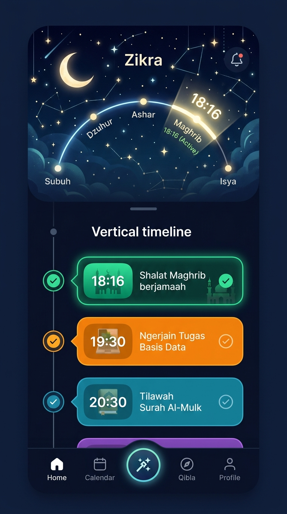
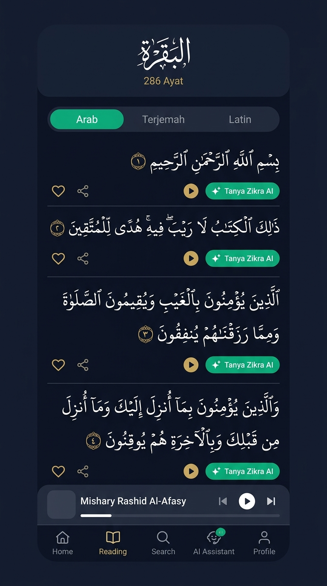
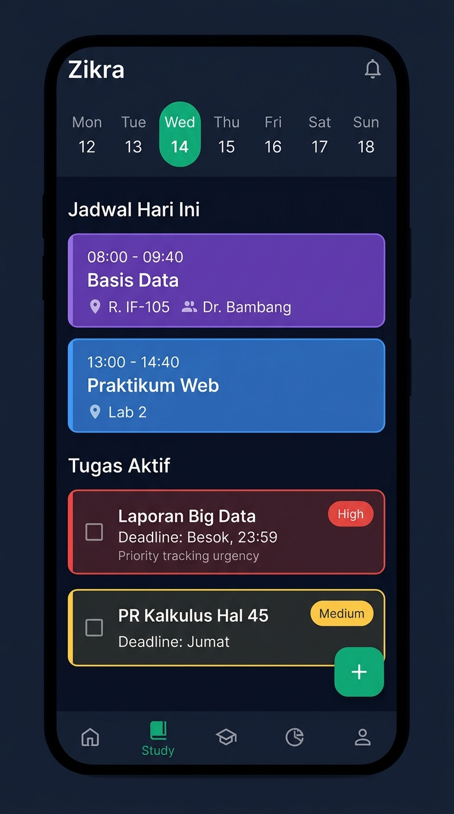
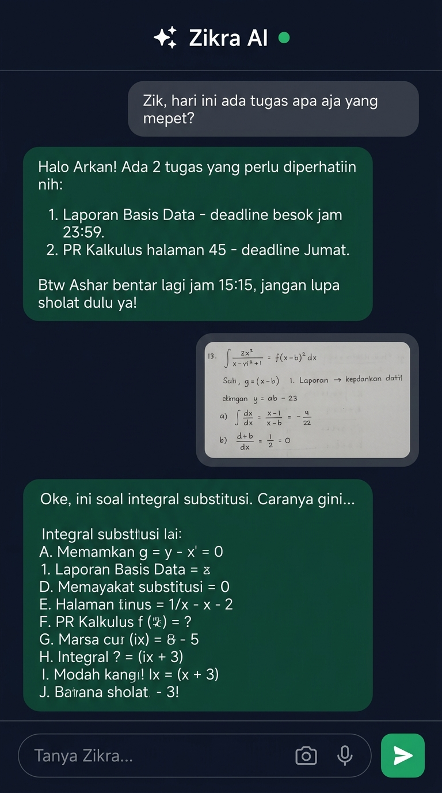
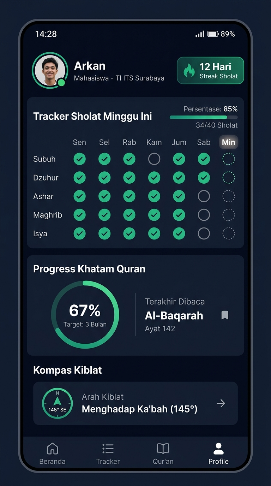
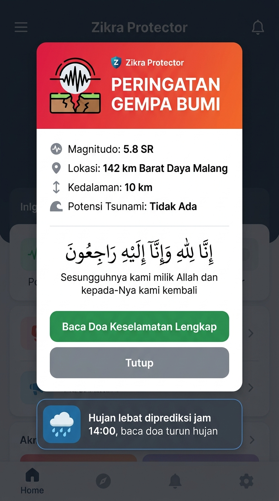

# 🎨 Zikra App — Koleksi Lengkap Mockup Desain UI

> **Konsep Utama:** Dark Slate + Emerald Glow | Fusion Pillars × Structured  
> **Target User:** Pelajar SMP/SMA & Mahasiswa Muslim Indonesia

---

## 🏷️ Logo & Branding Identity

### Logo Utama (Rekomendasi): Bulan Sabit + Buku + AI Sparkle



**Filosofi 3-in-1 (satu ikon merepresentasikan semua fitur):**
| Elemen Visual | Makna | Fitur Zikra yang Diwakili |
|---|---|---|
| 🌙 Bulan Sabit Hijau Zamrud | Islam, Ibadah, Waktu Sholat | Pilar 1 (Smart Ibadah) + Pilar 4 (Zikra Protector & Doa) |
| 📖 Buku Terbuka di Pangkuan Bulan | Al-Quran + Ilmu Pengetahuan | Pilar 2 (Ngaji & Tadabbur) + Pilar 3 (Asisten Pelajar) |
| ✨ Bintang Emas 4-Titik (Sparkle) | Kecerdasan Buatan (AI) | Pilar 5 (Zikra AI — Otak Cerdas Aplikasi) |

**Palet Warna Logo:**
- Hijau Zamrud `#10B981` — Segar, modern, Islami kontemporer
- Emas `#F59E0B` — Aksen premium & kecerdasan
- Navy Gelap `#0B132B` — Background elegan

---

### Alternatif Logo yang Sudah Di-explore

````carousel
**Konsep A: Bulan Sabit + Buku (Pertama)**


Versi awal dengan komposisi serupa, bulan merangkul buku terbuka dan sparkle AI.
<!-- slide -->
**Konsep B: Huruf Arab ذ (Dzal) Geometris**



Huruf pertama dari ذِكْرَى (Dzikra) distilisasi modern dengan efek neon glow. Terinspirasi dari logo **Tarteel AI** yang menggunakan nuqta huruf ت.
<!-- slide -->
**Konsep C: Lonceng Pengingat + Bulan Sabit**



Lonceng notifikasi (melambangkan fungsi pengingat/reminder) dengan bulan sabit & bintang. Paling intuitif untuk dipahami semua usia.
````

---

### Referensi Logo Kompetitor (Benchmark)

| Kompetitor | Ikon Logo | Filosofi |
|---|---|---|
| **Pillars** | 5 titik/dot vertikal | 5 Pilar Islam → minimalis ekstrem |
| **Tarteel AI** | 2 nuqta huruf ت (Ta') | Huruf Arab pertama nama app → kaligrafi modern |
| **Structured** | Centang + garis timeline | Aksi utama user: mencentang tugas di timeline |
| **Zikra** ⭐ | Bulan + Buku + Sparkle | Islam + Ilmu + AI → semua fitur terwakili |

---

## 1️⃣ Onboarding Screen (Pertama Kali Buka App)
Layar pertama saat user baru install. Pilih jenjang pendidikan untuk menyesuaikan tampilan dan istilah di seluruh aplikasi.



**Highlight Desain:**
- Logo bulan sabit dengan motif geometris Islami yang elegan
- 4 pilihan kartu *glassmorphism*: **Siswa SMP**, **Siswa SMA**, **Mahasiswa**, **Umum**
- Kartu yang dipilih menyala hijau zamrud
- Tombol **"Mulai"** besar berwarna hijau di bawah

---

## 2️⃣ Home Screen (The Fusion: Pillars Header + Structured Timeline)
Layar utama harian. Bagian atas menampilkan visual langit dengan orbit 5 waktu sholat (ala **Pillars**), bagian bawah adalah timeline aktivitas harian yang bisa dicentang (ala **Structured**).



**Highlight Desain:**
- **Header Langit Dinamis:** Langit malam berbintang & bulan sabit, dengan lengkungan orbit 5 waktu sholat. Waktu aktif (Maghrib) bercahaya keemasan
- **Vertical Timeline Cards:** Kartu pastel warna-warni untuk setiap aktivitas: sholat (hijau), kuliah (ungu/biru), tugas (oranye)
- **Checkmark Bulat:** Setiap aktivitas bisa dicentang saat selesai
- **Tombol Sparkle Zikra AI** di tengah navigasi bawah

---

## 3️⃣ Quran Reader (Mushaf Digital + Audio + AI Tafsir)
Tampilan baca Al-Quran 30 juz dengan teks Arab yang besar dan nyaman, lengkap dengan audio murottal dan tombol **"Tanya Zikra AI"** di setiap ayat.



**Highlight Desain:**
- **Header Surah:** Nama surah dalam kaligrafi Arab yang elegan + jumlah ayat
- **Toggle 3 Mode:** Arab (aktif hijau) | Terjemah | Latin
- **Teks Arab Mushaf:** Font besar, lega, enak dibaca di layar HP
- **Nomor Ayat Emas:** Penanda ayat berwarna emas di ujung setiap ayat
- **Action Bar per Ayat:** ❤️ Bookmark, 🔗 Share, ▶️ Play Audio, ✨ **Tanya Zikra AI**
- **Floating Audio Player:** Bar audio murottal di bawah (Mishary Rashid Al-Afasy) dengan kontrol play/pause/next

---

## 4️⃣ Study & Tasks (Jadwal Kuliah/Sekolah + Deadline Tugas)
Layar manajemen jadwal pelajaran dan daftar tugas dengan indikator prioritas dan deadline countdown.



**Highlight Desain:**
- **Horizontal Week Calendar:** Baris hari Senin–Minggu, hari ini (Rabu) disorot lingkaran hijau
- **Jadwal Hari Ini:** Kartu berwarna per mata kuliah/pelajaran
  - 🟣 Ungu: Basis Data (08:00–09:40, R. IF-105, Dr. Bambang)
  - 🔵 Biru: Praktikum Web (13:00–14:40, Lab 2)
- **Tugas Aktif (Sorted by Urgency):**
  - 🔴 HIGH: Laporan Big Data (Deadline: Besok, 23:59)
  - 🟡 MEDIUM: PR Kalkulus Hal 45 (Deadline: Jumat)
- **FAB Hijau (+):** Tombol tambah tugas baru di pojok kanan bawah

---

## 5️⃣ Zikra AI Chat (Asisten Cerdas Kontekstual)
Interface percakapan dengan AI yang tahu jadwal, tugas, dan waktu sholat user. Mendukung kirim foto soal PR (Vision) dan voice input.



**Highlight Desain:**
- **Header:** "✨ Zikra AI 🟢" (menandakan AI sedang online dan siap)
- **Chat Bubble User (Kanan, Abu-abu):** *"Zik, hari ini ada tugas apa aja yang mepet?"*
- **Chat Bubble Zikra AI (Kiri, Hijau Zamrud):** Jawaban kontekstual yang menyebutkan 2 tugas deadline + pengingat waktu sholat Ashar
- **Foto Soal PR:** User mengirim foto soal integral → Zikra AI menganalisis dan membimbing langkah penyelesaiannya
- **Input Bar Bawah:** Field teks "Tanya Zikra..." + 📷 Kamera + 🎤 Mikrofon + ▶ Kirim

---

## 6️⃣ Ibadah Tracker & Profil (Streak Sholat + Progress Khatam + Kiblat)
Dashboard spiritual pribadi yang menampilkan konsistensi ibadah mingguan, progress tilawah Al-Quran, dan kompas arah kiblat.



**Highlight Desain:**
- **Profil Header:** Avatar + Nama (Arkan) + Status (Mahasiswa TI ITS Surabaya) + Badge **"🔥 12 Hari Streak Sholat"**
- **Grid Tracker Sholat Mingguan:**
  - Baris: Subuh, Dzuhur, Ashar, Maghrib, Isya
  - Kolom: Sen–Min
  - ✅ Hijau: Sudah sholat | ⭕ Abu-abu: Belum/terlewat | ◌ Dotted: Belum tiba
  - Progress bar: **85% (34/40 Sholat)**
- **Progress Khatam Quran:**
  - Ring melingkar hijau **67%** — Target: 3 Bulan
  - Terakhir dibaca: **Al-Baqarah Ayat 142**
- **Kompas Kiblat:** Arah 145° SE → Menghadap Ka'bah

---

## 7️⃣ Zikra Protector (Popup Darurat + Doa Kontekstual)
Popup notifikasi darurat yang menggabungkan data realtime (BMKG/Cuaca) dengan tuntunan doa sesuai sunnah.



**Highlight Desain:**
- **Header Gradient Merah-Oranye:** Ikon gempa + "PERINGATAN GEMPA BUMI" (mencolok dan darurat)
- **Data BMKG:** Magnitudo 5.8 SR, Lokasi, Kedalaman 10 km, Potensi Tsunami: Tidak Ada
- **Doa Arab + Terjemahan:** *"Inna lillahi wa inna ilaihi raji'un"* — Sesungguhnya kami milik Allah dan kepada-Nya kami kembali
- **Tombol Hijau:** "Baca Doa Keselamatan Lengkap" → membuka halaman kumpulan doa
- **Alert Cuaca (Bawah):** Notifikasi sekunder hujan lebat + ajakan baca doa turun hujan

---

## 📐 Ringkasan Alur Navigasi

```
Onboarding → Home Screen (Fusion Timeline)
                 │
    ┌────────────┼────────────┬──────────────┐
    ▼            ▼            ▼              ▼
📖 Quran     📚 Study      ✨ Zikra AI    👤 Profil
 Reader      & Tasks        Chat          & Ibadah
                                          Tracker
                                             │
                                        🛡️ Protector
                                        (Popup Overlay)
```
